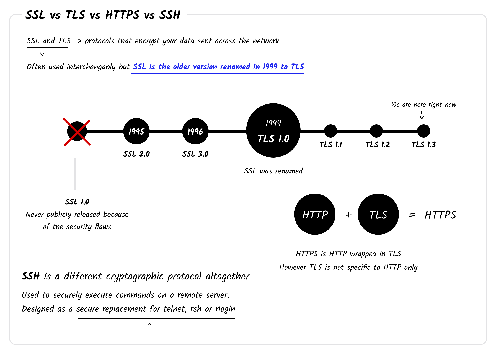
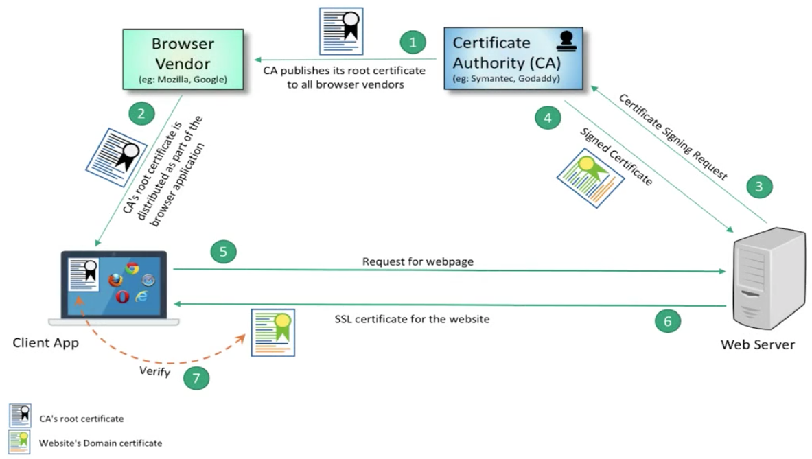

---
categories:
- Share
date: '2020-05-22'
tags:
- Web Development
- SSL
---

# HTTPS, SSL and TLS

Source: [SSL vs TLS vs SSH](https://roadmap.sh/guides/ssl-tls-https-ssh)

SSL 與 TLS 都是將網路傳輸內容加密的通訊協定，兩者時常被交替使用表達加密這件事，但精準來說 SSL 已經在 1999 年被重新命名為 TLS，一般提到 SSL 都是表示 TLS。被 TLS 包裝的 HTTP 即為 HTTPS，但 TLS 並不僅侷限用於 HTTP 上。

SSL 有以下幾個優點：

1. Source identity verification  
   驗證瀏覽的網頁是正牌還是假冒的
2. Security against Man-in-the-middle (MITM) attacks  
   預防中間人攻擊，所有傳輸的資料都會經過加密，即使被攔截也無法解密
3. Client/Server authentication  
   Client 與 Server 可以雙向認證
4. Non-Repudiation  
   SSL 連線建立後，所有的行為都具有不可否定性 (Non-Repudiation)，因為加密確保了內容不會被更改

## SSL 通訊步驟

Source: [那些關於SSL/TLS的二三事(二) — How SSL works?](https://medium.com/@clu1022/%E9%82%A3%E4%BA%9B%E9%97%9C%E6%96%BCssl-tls%E7%9A%84%E4%BA%8C%E4%B8%89%E4%BA%8B-%E4%BA%8C-how-ssl-works-a9d6720bdd48)

共有四個角色，分別為 Certificate Authority(CA)、Browser Vender 瀏覽器廠商、Client、Web Server。

前四個步驟為 SSL 的初始化作業，之後才是 Client 與 Server 做 SSL 通訊。

1. CA 發行公鑰給各大瀏覽器廠商
2. 瀏覽器廠商將各 CA 的公鑰附在瀏覽器上，讓使用者可以取得
3. Server 擁有者向 CA 申請憑證，綁定 Domain Name，憑證區分不同等級，要繳交的驗證資料與費用也有所不同，也有免費的憑證可以申請，如：[Let's Encrypt](https://letsencrypt.org/)
4. 將 CA 核發的憑證設定在 Server 的 config 中
5. Client 發起 SSL 通訊
6. Server 回覆 CA 核發的憑證
7. Client 根據附在瀏覽器上 CA 的公鑰驗證是否是合法的憑證

## 憑證簽發

憑證可以分為 CA 簽發與自簽兩種

常見的 CA 清單可以參考 [Top 9 Best SSL Certificate Authority List & SSL Certificate Brands](https://aboutssl.org/the-worlds-most-trusted-ssl-brands/)，例如賽門鐵克(Symantec)也有在做憑證簽發。SSL 的安全性是建立在 CA 所發行的憑證，若 CA 發行錯誤或有問題的憑證將無法保證 SSL 所提供的安全性，如中國的 [CNNIC](https://zh.wikipedia.org/wiki/%E4%B8%AD%E5%9C%8B%E4%BA%92%E8%81%AF%E7%B6%B2%E7%B5%A1%E4%BF%A1%E6%81%AF%E4%B8%AD%E5%BF%83) 在 2015 年被發現發行了 Google 域名的假憑證、中國的 WoSign 所發行的憑證有控管上的問題被 Apple 封鎖 ([封鎖對 WoSign CA Free SSL Certificate G2 的信任](https://support.apple.com/zh-tw/HT204132))。

另外一種是自簽憑證，通常用於封閉式網站或用於開發環境，使用 [OpenSSL](https://www.openssl.org/) 自行簽發憑證，再將憑證安裝到使用者的瀏覽器或開發環境中。OpenSSL 的憑證簽發與使用可以參考 [如何使用 OpenSSL 建立開發測試用途的自簽憑證 (Self-Signed Certificate)](https://blog.miniasp.com/post/2019/02/25/Creating-Self-signed-Certificate-using-OpenSSL)。

## 憑證狀態

在 2018/10 的 Chrome 70 之後所有 HTTP 的網頁在網址列都會被標示「不安全」，而 HTTPS 會有一個鎖頭 icon。可以利用 [badssl.com](https://badssl.com/) 查看在瀏覽器上的效果，該網站了模擬憑證的各種狀況，如過期、錯誤的 host 等等。

網站若有憑證需注意憑證是否到期，避免發生如 [中國 Tesla 憑證過期導致車子無法啟動](https://www.techbang.com/posts/78550-chinas-tesla-app-large-scale-on-board-resulting-in-car-owners-can-not-even-drive-or-can-only-blind-drive) 這類事件。

Reference:

1. [那些關於SSL/TLS的二三事(一) — Why SSL/TLS?](https://medium.com/@clu1022/%E9%82%A3%E4%BA%9B%E9%97%9C%E6%96%BCssl-tls%E7%9A%84%E4%BA%8C%E4%B8%89%E4%BA%8B-%E4%B8%80-why-ssl-tls-77ab5f4ba85)
2. [那些關於SSL/TLS的二三事(二) — How SSL works?](https://medium.com/@clu1022/%E9%82%A3%E4%BA%9B%E9%97%9C%E6%96%BCssl-tls%E7%9A%84%E4%BA%8C%E4%B8%89%E4%BA%8B-%E4%BA%8C-how-ssl-works-a9d6720bdd48)
3. [那些關於SSL/TLS的二三事(三) — 給誰簽?](https://medium.com/@clu1022/%E9%82%A3%E4%BA%9B%E9%97%9C%E6%96%BCssl-tls%E7%9A%84%E4%BA%8C%E4%B8%89%E4%BA%8B-%E4%B8%89-%E7%B5%A6%E8%AA%B0%E7%B0%BD-b1741f2abc03)
4. [如何對抗 DNS 劫持?](https://news.gandi.net/zh-hant/2019/07/how-to-fight-dns-hijacking/)
