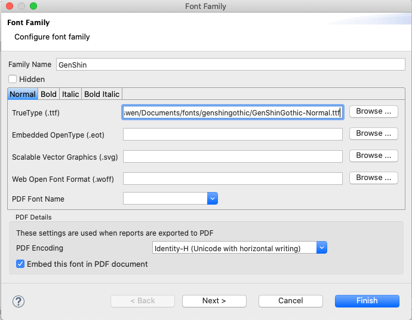
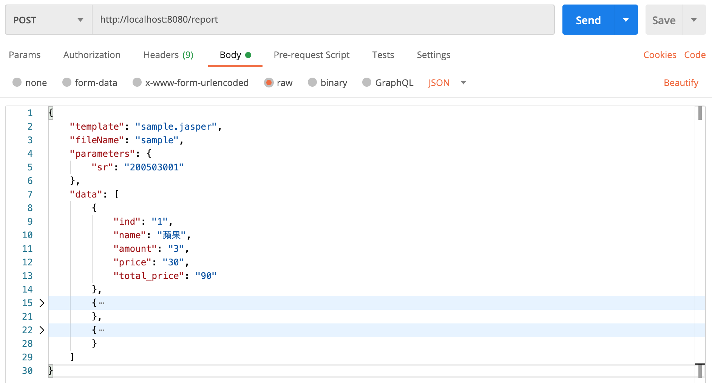
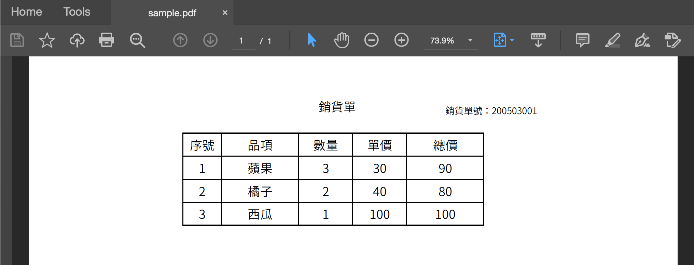

---
categories:
- Share
date: 2020-11-29
tags:
- Spring Boot
- JasperReport
---

# JasperReports with Spring

[JasperReport](https://community.jaspersoft.com/project/jasperreports-library) 是一套以 Java 開發的開源報表程式庫，最初的版本發佈於 2001 年，能透過預先定義的模板將動態資料導入生成 PDF、HTML 或 Excel 等檔案。

雖然 JasperReport 已經是很古老的程式庫，但在模板設計工具與使用的便利性上，仍沒有新生代的開源專案能匹敵。或許是因為現在的報表大多直接使用 Web 的方式進行呈現，模板類型的工具就不太有人會投注心力開發了。

在使用 JasperReport 時最大的困擾就是中文或自訂字體的顯示問題，時常發生在模板設計階段可以正常顯示中文，但本機運行服務或上到 Production Server 時發現無法正常顯示中文。稍微 Google 後就可以發現大家為了解決中文顯示問題使用了各種奇技淫巧，但其實使用官方所提出的 [Font Extension](https://community.jaspersoft.com/wiki/custom-font-font-extension) 就可以完美地解決自訂字體的問題。

以下將分享一個簡單的 JasperReports Application 專案與 Font Extension 在設定時的眉角。

### JasperReports with Spring

[jasperreports-with-spring](https://github.com/Blueswen/jasperreports-with-spring) 是一個 Maven 專案，使用 Spring Boot 作為 Server 依據 request 利用 JasperReport 生成 PDF 報表，字體使用[思源真黑體](http://jikasei.me/font/genshin/)，能夠支援顯示中文。設定了 Dockerfile 與 docker-compose 用於建置 Docker Image 與啟動服務，可以把它視為一個專門負責生成報表的微服務。

專案中使用的 jrxml 模板為 [sample.jrxml](https://github.com/Blueswen/jasperreports-with-spring/blob/main/reference/sample.jrxml)，而生成的 PDF 可以參考 [sample.pdf](https://github.com/Blueswen/jasperreports-with-spring/blob/main/reference/sample.pdf)。

Lib Dependencies:

1. Spring Boot 2.3.5
2. JasperReports 6.16.0

JasperReport Dependencies:

1. TIBCO Jaspersoft® Studio 6.16.0
2. Source .jrxml Version: JasperReport 6.13.0
3. Compiler Settings: 6.16.0

### Jaspersoft Studio

jrxml 與 jasper 使用 [Jaspersoft Studio](https://community.jaspersoft.com/project/jaspersoft-studio) 編輯與生成，預設的 jasper compiler 會隨著 Jaspersoft Studio 的版本有所不同，當編譯 jasper 的版本與 run time 時產製報表的版本不相容時候會導致產製失敗。

可以透過更改 Jaspersoft Studio 的 compiler 版本解決這個問題，調整位置為 ```Preference => Jaspersoft Studio => Compatibility => Compiler Settings => Manage JasperReports Versions```。但 Add From URL 無法正常指定到 compiler，所以改為直接至 [sourceforge](https://sourceforge.net/projects/jasperreports/files/jasperreports/) 下載整個 project zip 檔，再以 Add From Path 的方式使用。

### Font Extension

Jaspersoft Studio 在 v6.0 提出了 [Font Extension](https://community.jaspersoft.com/wiki/custom-font-font-extension) 用於解決自訂字體的問題。在過去的版本中大多使用 PDF Embedded、PDF Encoding 與 PDF Font Name 這三個屬性設定 PDF 輸出時的字體設定，在 v6.0 後的 Jaspersoft Studio 這種設定方式仍可以相容，但會顯示為不推薦使用。

此專案中使用開源的[思源真黑體](http://jikasei.me/font/genshin/)作為自訂字體，思源真黑體是由 Google 與 Adobe 開源的思源黑體修改而來，在細部進行了些微調整，使字體看起來更加銳利，並提供了 Font Extension 需要使用的 TTF 的版本。

Jaspersoft Studio 新增 Font 時的設定參考下圖，PDF Encoding 選擇 ```Identify-H (Unicode with horizontal writing)```。



完成自訂字體設定後，就可以在 Font 中看到剛剛設定的字體，這時候可以利用 Preview 的功能並另存成 PDF 檢查字體是否能正常使用。

模板設計完成後，接下來就是要讓 Application 能正常載入並使用字體，依照 [Font Extension](https://community.jaspersoft.com/wiki/custom-font-font-extension) 中的說明將 font extension jar 匯出。官網 wiki 給的說明是直接放在 application 的 classpath 中```jasperserver-pro/WEB-INF/lib```。但如果是使用 Spring Boot 則應該透過 pom 進行相依的設定，因此將字體 jar 檔放於 project 根目錄的 lib 資料夾中，在 pom.xml 增加此 jar 的 dependency。

```xml
<dependency>
    <groupId>com.blueswen</groupId>
    <artifactId>customfont</artifactId>
    <version>1.0</version>
    <scope>system</scope>
    <systemPath>${basedir}/lib/genshin.jar</systemPath>
</dependency>
```

而為了讓 external jar 能夠被打包進最後的成品中，需要使用 ```spring-boot-maven-plugin``` plugin，並設定 ```includeSystemScope``` 為 true。

```xml
<build>
    <plugins>
        <plugin>
            <groupId>org.springframework.boot</groupId>
            <artifactId>spring-boot-maven-plugin</artifactId>
            <configuration>
                <includeSystemScope>true</includeSystemScope>
            </configuration>
        </plugin>
    </plugins>
</build>
```

### Request Sample

Server 運行後可以發送 Http Request 測試報表產製功能

```bash
curl \
  -X POST \
  -H "Content-Type: application/json" \
  -o sample.pdf \
  -d '{
    "template": "sample.jasper",
    "fileName": "sample",
    "parameters": {
      "sr": "200503001"
    },
    "data": [
      {
        "ind": "1",
        "name": "蘋果",
        "amount": "3",
        "price": "30",
        "total_price": "90"
      },
      {
        "ind": "2",
        "name": "橘子",
        "amount": "2",
        "price": "40",
        "total_price": "80"
      },
      {
        "ind": "3",
        "name": "西瓜",
        "amount": "1",
        "price": "100",
        "total_price": "100"
      }
    ]
  }' \
  http://localhost:8080/report
```

或者使用 Postman 發送 Request，發送時記得選擇 Send 下拉選單中的 Send and Download



取得的 PDF 如下圖，可以正常顯示中文



### 其他解決方案

如前面所述，有一些人提供了其他的方式解決中文顯示的問題，大部分都是在 application 中引入 [iTextAsian.jar](https://mvnrepository.com/artifact/com.itextpdf/itext-asian)，利用裡面打包好的宋體做 PDF 產製所使用的字體，但缺點是字體就會被侷限，在設計模板階段也會無法預覽正確字體，設定上也頗為麻煩。

在搞懂 Font Extension 前我也是依照這些分享使用這種方式，但後來發現限制實在太多，所以就還是走上正規的道路。雖然最後沒有採用這些解決方案，但有幾篇仍能提供一些不錯的思路，未來如果與到類似的問題或許可以作為參考。

[Jasperreport 与 Springmvc 结合生成 PDF web 页面笔记（含解决中文问题）](https://blog.csdn.net/jiangkai528/article/details/51133347)依照這篇文章提供的 dependencies 就能夠完整產製含有中文的報表，如果要使用繁體 pdfFontName 需設定為 MHei-Medium、MSung-Light 或 MSungStd-Light，pdfEncoding 設為 UniCNS-UCS2-H。而因為有限定了 jasperreports 的版本，所以可能會遇到使用 Jaspersoft Studio compile 出來的 jasper 在 run time 無法被使用的問題，這時候就要使用前面提到的調整 Jaspersoft Studio 的 compiler 版本來解決。

[iText-Asian jar可 以使用的中文字符及 iText——>html2pdf 使用(附坑)](https://blog.csdn.net/weixin_41807385/article/details/98478061) 針對 iTextAsian.jar 提供了比較詳細的介紹與說明。

Reference:

1. [Spring Boot with Docker](https://spring.io/guides/gs/spring-boot-docker/)
2. ["mvnw" won't work on docker-pipeline with the "maven" image because docker-pipeline doesn't honor docker image entrypoint](https://issues.jenkins.io/browse/JENKINS-47890)
3. [Custom Font with the Font Extension](https://community.jaspersoft.com/wiki/custom-font-font-extension)
4. [思源真黑體](http://jikasei.me/font/genshin/)
5. [用 Java 產出中文的 JasperReports PDF](http://cw1057.blogspot.com/2012/10/java-jasperreports-pdf.html)
6. [JASPER REPORTS WITH SPRING BOOT](https://github.com/gauravbrills/jasperreportswithspringboot)
7. [Jasper Reports using unavailable fonts](http://poor-developer.blogspot.com/2017/02/jasper-reports-using-unavailable-fonts.html)
8. [jasper 综合使用 - javabean 结合实际业务-解决 PDF 中文](https://blog.csdn.net/pspr2/article/details/78356835)
9. [Spring Boot 打包 external jar 解決方案](https://medium.com/@webber.cheng/spring-boot-%E6%89%93%E5%8C%85-external-jar-%E8%A7%A3%E6%B1%BA%E6%96%B9%E6%A1%88-292d6e800df5)
