---
categories:
- Tip
date: 2023-10-22
tags:
- Grafana
- Prometheus
---

# Grafana Stat Panel 同時顯示最新的值與 Sparkline

## 需求

在 Grafana 的 [Stat Panel](https://grafana.com/docs/grafana/latest/panels-visualizations/visualizations/stat/) 同時顯示最新的值與 Sparkline（迷你圖表）。

## 問題分析

Stat Panel 支援 Instant Query 與 Range Query：

1. Instant Query：Query Type `Instant`，只查詢最新的值，該值會顯示在 Panel 上
2. Range Query：Query Type `Range`，查詢一段時間內的值，最後一個值會顯示在 Panel 上，所有質會以 Sparkline 的方式顯示在 Panel 上

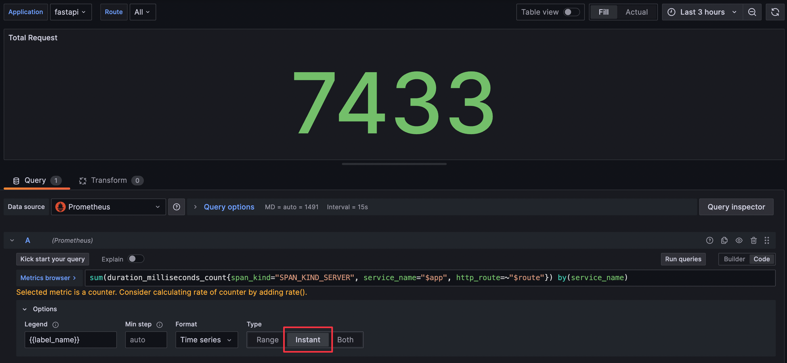  
Instant Query 畫面

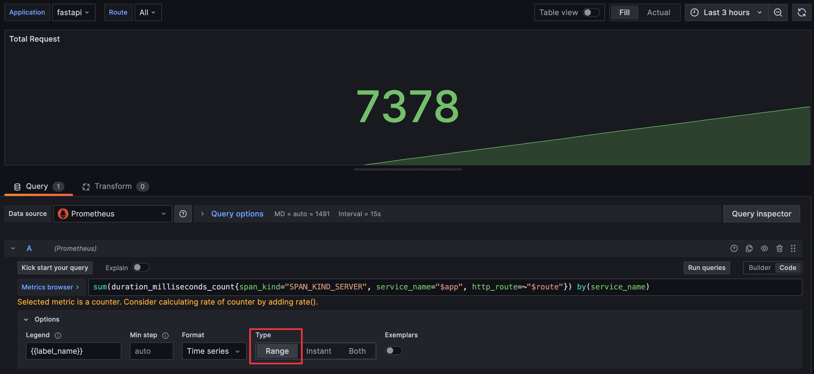  
Range Query 畫面

但單純使用 Range Query 時會發現，有時候改變時間區間時，顯示在 Panel 上想像中代表最新的值會變大或變小，導致使用者會對於數值的正確性產生疑慮。

這是因為在 Grafana 使用 Range Query 時，實際的查詢時間區間會為了配合查詢 Prometheus 時要使用的 [Step 參數](https://prometheus.io/docs/prometheus/latest/querying/api/#range-queries)而被[調整](https://github.com/grafana/grafana/blob/v10.1.5/pkg/tsdb/prometheus/models/query.go#L147)，查詢使用的開始與結束時間都會變得比 Grafana 畫面設定的時間區間還要早。若調整後的結束時間與畫面設定的結束時間中間剛好有資料點時，就會發生 Range Query 的結果不是該 Series 最新的值，而是調整後的結束時間點往前找到的值，如下圖所示：

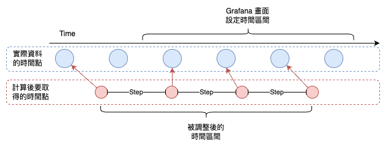  
藍色的最後一個資料點，因為查詢時間位移的關係而不會被該次查詢查到

更詳細的 Step 參數與 Grafana 設定方式將於另一篇文章中說明。

雖然可以使用 Both Type 進行查詢，同時顯示 Instant Query 與 Range Query 的結果，但 Panel 會顯示兩個值，容易造成使用者混淆。

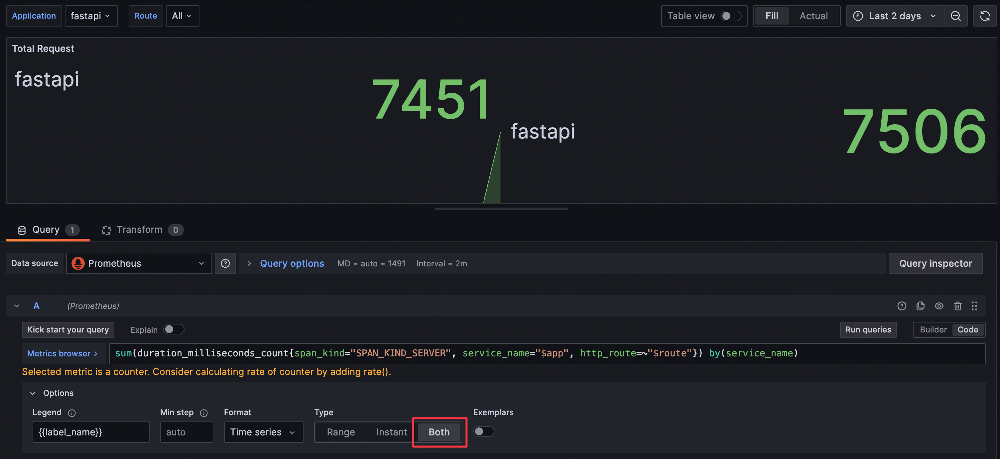  
Both Query 畫面

圖中也可以看到，右側 Instant Query 的值與左側 Range Query 的值不同，這在查詢區間範圍較大時會更明顯。

## 解法

使用 `Both` Type，並將兩個 Series 合併，讓 Instant Query 的值最為最後一個值，同時有 Range Query 的資料供繪製 Sparkline。

1. 使用 `Both` Type 查詢
   
    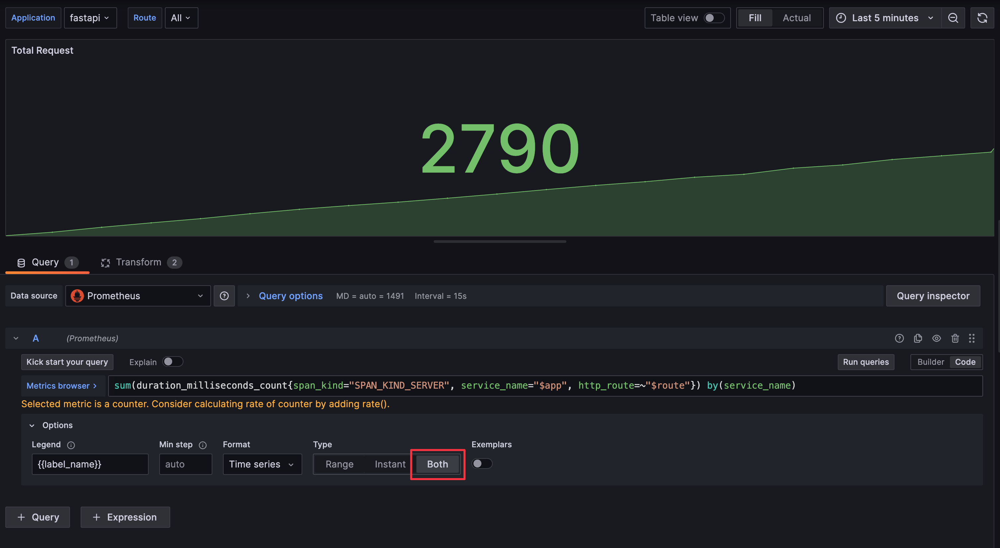  
    Query Type 設定

2. 使用 `Series to rows` 與 `Sort by` 兩個 Transform
    1. [Series to rows](https://grafana.com/docs/grafana/latest/panels-visualizations/query-transform-data/transform-data/#series-to-rows)：將 Instant Query 與 Range Query 的資料合併
    2. [Sort by](https://grafana.com/docs/grafana/latest/panels-visualizations/query-transform-data/transform-data/#sort-by)：將合併後的資料依照 `Time` 欄位排序，確保最後一筆資料為最新的資料

    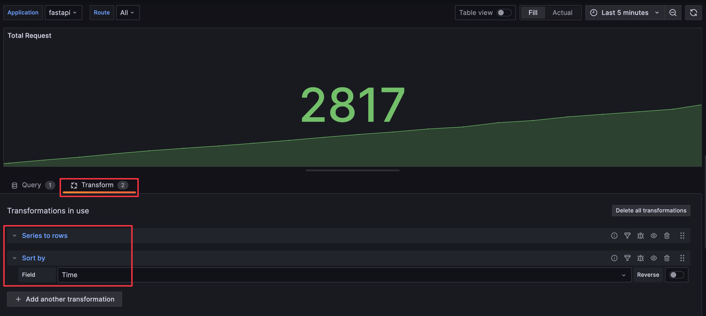  
    Transform 設定

### 說明

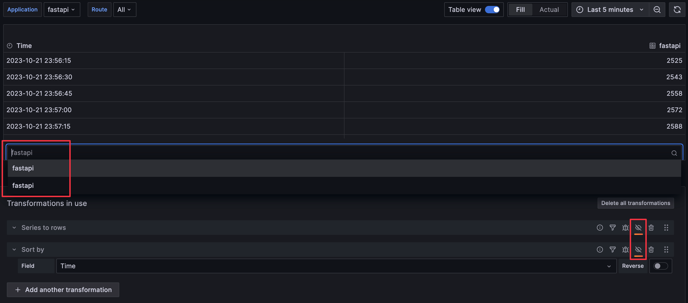  
先關閉 Transform，並切換為 Table 檢視，可以看到兩個 Series，第一個是 Range Query 的資料。

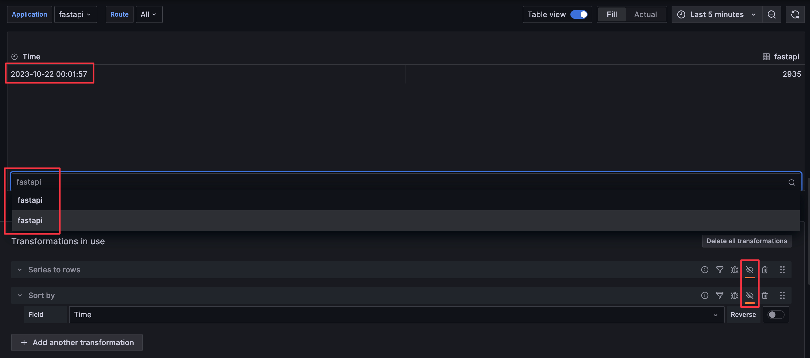  
第二個是 Instant Query 的資料。

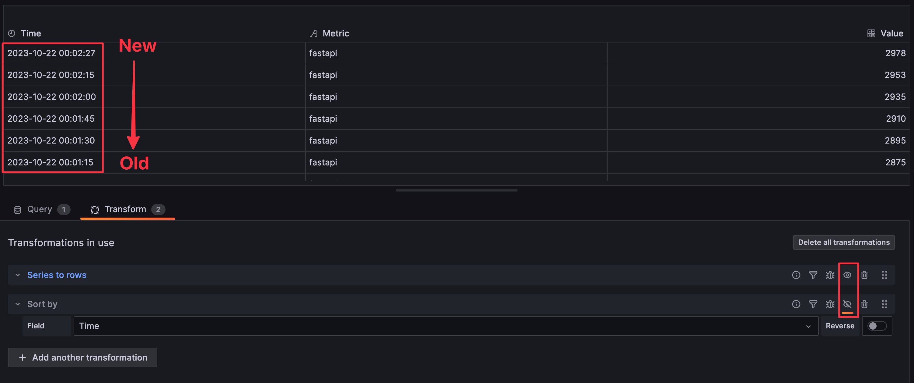  
啟用 `Series to rows` transform，兩個 Series 會合併成一個 Series，但預設的排序是依照時間欄位降冪排序，導致最後一筆資料不是最新的資料，而 Stat Panel 預設會顯示最後一筆資料。

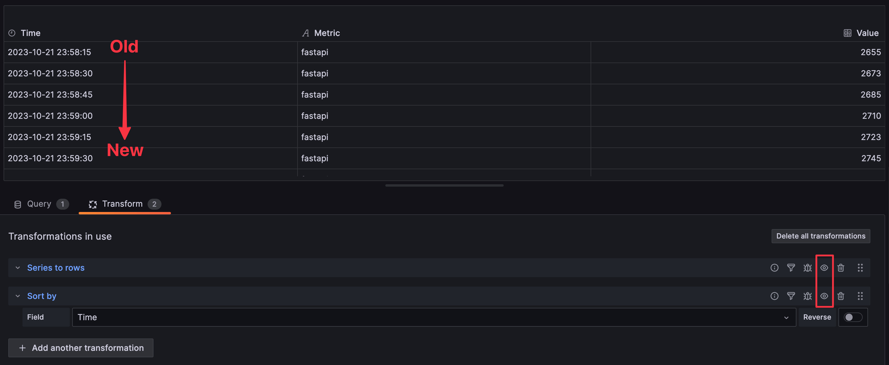  
啟用 `Sort by` transform，並以 `Time` 欄位排序，確保最後一筆資料為最新的資料。

### 多筆資料應用

如果想要在同一個 Stat Panel 上顯示多筆資料但達到一樣的效果，則要使用多額外使用 `Partition by values` transform 以 `Metrics` 欄位分割資料。

1. 使用 `Both` Type 查詢

    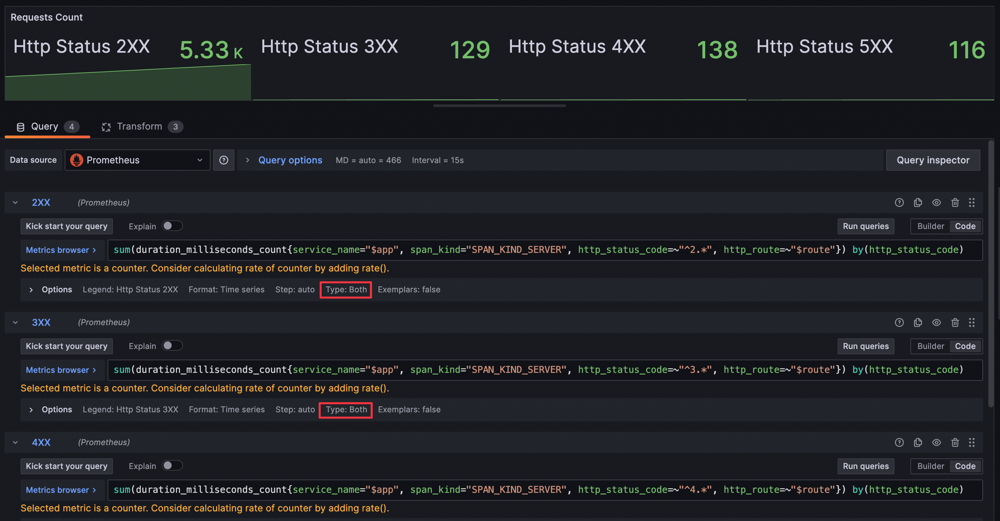  
    Query Type 設定

2. 使用 `Series to rows`、`Sort by`、`Partition by values` 三個 Transform
    1. [Series to rows](https://grafana.com/docs/grafana/latest/panels-visualizations/query-transform-data/transform-data/#series-to-rows)：將 Instant Query 與 Range Query 的資料合併
    2. [Sort by](https://grafana.com/docs/grafana/latest/panels-visualizations/query-transform-data/transform-data/#sort-by)：將合併後的資料依照 `Time` 欄位排序，確保最後一筆資料為最新的資料
    3. [Partition by values](https://grafana.com/docs/grafana/latest/panels-visualizations/query-transform-data/transform-data/#partition-by-values)：將全部被合併的資料再以 `Metrics` 欄位分割成多筆 Series

    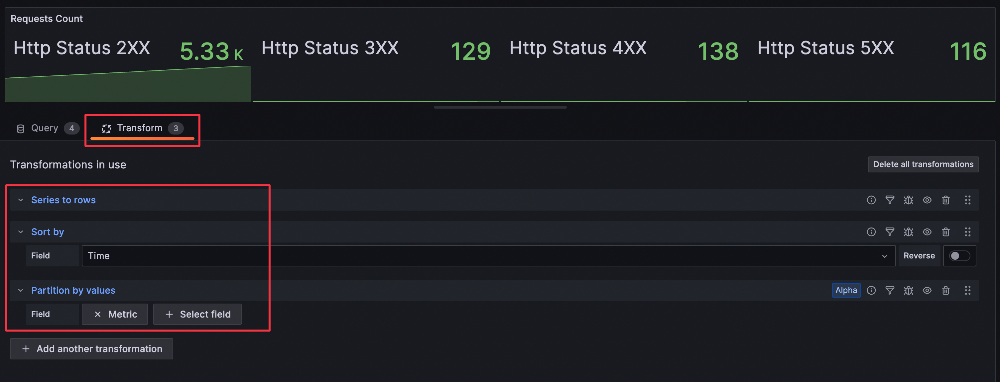  
    Transform 設定

參考資料：

1. [How to easily retrieve values from a range in Grafana using a stat panel](https://grafana.com/blog/2023/10/18/how-to-easily-retrieve-values-from-a-range-in-grafana-using-a-stat-panel/)
2. [详解Prometheus range query中的step参数](https://cloud.tencent.com/developer/article/1382875)
