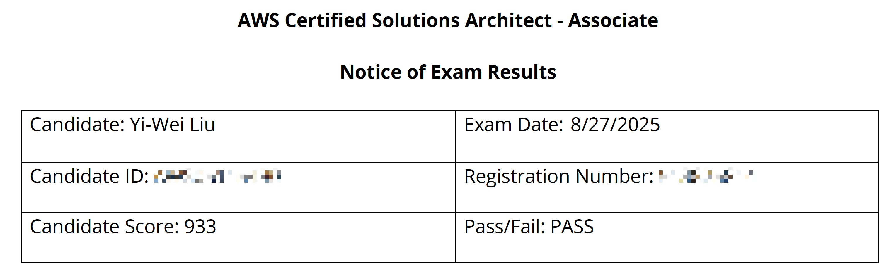
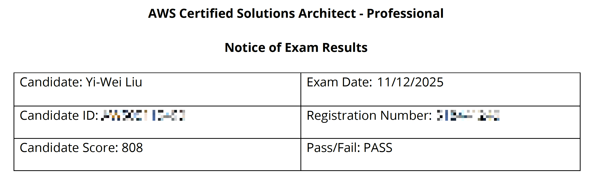

---
categories:
- Share
date: 2025-12-14
tags:
- AWS
---

# AWS SAA 與 AWS SAP 認證考試心得分享

受惠於社群分享的資訊，在準備 AWS SAA（Solutions Architect - Associate） 跟 SAP（Solutions Architect - Professional）上順利了許多，簡單紀錄準備的過程與資源，提供給有興趣的朋友參考。

## 個人背景

背景對於準備的時間、方式會有很大的影響，簡單說明一下我的背景：

1. 接觸 AWS 約 1.5 年，但工作時間約只有 10% ~ 20% 使用 AWS 相關服務，主要集中在 S3、Lambda。
2. 6 年 DevOps 經驗，熟悉 CI/CD、三層式架構、Container、Kubernetes、基礎網路概念、基礎 Linux 知識。

## SAA C03

學習資源：Stephane Maarek 的 [Ultimate AWS Certified Solutions Architect Associate](https://www.udemy.com/course/aws-certified-solutions-architect-associate-saa-c03/) $290 NTD

模擬試題：Stephane Maarek 跟 Abhishek Singh 的 [Practice Exams | AWS Certified Solutions Architect Associate](https://www.udemy.com/course/practice-exams-aws-certified-solutions-architect-associate/) $290 NTD

因為已經有 CI/CD、基礎網路概念、基礎 Linux 知識等知識，所以看 Stephane 的課程的時候通常開 1.25 倍或 1.5 倍速來看。大部分的時候可以很快跟原有知識連結，知道哪些需求可以用 AWS 上哪些服務來解決。看的時候會隨手簡單紀錄關鍵字跟功能，算是避免看到恍神分心。

課程看完一遍之後，直接開始做模擬試題，課程會附一份，另外購買的模擬試題有六份，都比照正式的 65 題目數量跟 130 分鐘，難度會比實際上略難，題目與選項也會更長一點，但可以當作負重訓練。

分大約兩週半做了兩輪，第一輪分數都沒有達到通過的標準，但關鍵在於錯誤的檢討跟知道自己哪些服務不熟，最後會有詳細的題目與選項說明可以看。為了加快檢討速度，我是直接把題目跟詳解貼到 GhatGPT 中，請他幫我整理說明，Prompt 如下：

```text
協助我了解 AWS SAA 考題的內容與解答，並給予相關的答題技巧，請用繁體中文回答我
我會提供你題目跟解答，提供後你再開始回答我
```

做完第一輪之後，休息個一兩天後開始第二輪。雖然題目一樣，但因為量體很大，而且又都是很長的英文題目，比較不太會有反射性背答案的問題。第二輪的分數大部分都有達到通過標準，之後就直接上考場了。模擬試題分數如下：

| 模擬試題輪次 | 模擬試題 1 | 模擬試題 2 | 模擬試題 3 | 模擬試題 4 | 模擬試題 5 | 模擬試題 6 | 模擬試題 7 |
| ------------- | ----------- | ----------- | ----------- | ----------- | ----------- | ----------- | ----------- |
| 第一輪       | 52%         | 55%         | 60%         | 60%         | 67%         | 70%         | 69%         |
| 第二輪       | 87%         | 66%         | 73%         | 80%         | 86%         | 84%         | 84%         |

最後考試分數為 993/1000（720 分通過），有看到兩、三題是跟模擬試題一樣的題目。



[Credly 證書](https://www.credly.com/badges/62906986-e54d-4700-9ea2-7d764077a3e5)

## SAP C02

學習資源：

1. Stephane Maarek 的 [Ultimate AWS Certified Solutions Architect Professional](https://www.udemy.com/course/aws-solutions-architect-professional/) $320 NTD
2. [AWS Skill Builder](https://skillbuilder.aws/) 訂閱一個月 $29 USD

模擬試題：

1. Stephane Maarek 跟 Abhishek Singh 的 [Practice Exam AWS Certified Solutions Architect Professional](https://www.udemy.com/course/practice-exam-aws-certified-solutions-architect-professional/) 三組模擬試題，其中第一組只有 30 題 $310 NTD
2. Tutorials Dojo 的 [AWS Certified Solutions Architect Professional Practice Exam](https://www.udemy.com/course/aws-solutions-architect-professional-practice-exams-sap-c02/) 四組模擬試題 $310 NTD
3. [AWS Skill Builder](https://skillbuilder.aws/) Official Practice Exam: AWS Certified Solutions Architect - Professional 一組模擬試題 

考完 SAA 之後，休息了一個月後開始繼續準備 SAP，一樣是 1.25 倍或 1.5 倍速來看 Stephane 的課程，SAP 的課程會更詳細介紹備份、災難復原、混合雲、帳號組織架構、管理等議題。

SAP 的內容單純只是聽過沒有辦法記得或直接想像是怎麼達成的，所以另外訂閱了 AWS Skill Builder，專門用來做裡面的 Lab 加深印象，我總共做了 30 個 Lab。雖然 Lab 幾乎都是依照指示操作，但在操作的過程中還是可以熟悉服務的功能與選項，對於了解功能與加深記憶還是很有幫助。

看完課程後就開始交錯做模擬試題跟做 Lab，模擬試題總共有八組，題目數量是 75 題，時間 180 分鐘，難度也比正式考試高一些。模擬試題的檢討方式一樣是用 ChatGPT 幫忙整理說明， Prompt 如下：

```text
協助我了解 AWS SAP 考題的內容與解答，並給予相關的答題技巧，請用繁體中文回答我
我會提供你題目跟解答，提供後你再開始回答我
```

跟 SAA 採取一樣的策略，做兩輪模擬試題，不過中間穿插模擬試題中發現不熟悉的服務的 Lab 來加深印象。模擬試題分數如下：

| 模擬試題輪次 | Stephane 模擬試題 1 | Stephane 模擬試題 2 | Stephane 模擬試題 3 | Dojo 模擬試題 1 | Dojo 模擬試題 2 | Dojo 模擬試題 3 | Dojo 模擬試題 4 | Skill Builder 模擬試題 1 |
| ------------- | ----------- | ----------- | ----------- | ----------- | ----------- | ----------- | ----------- | ----------- |
| 第一輪       | 60%         | 65%         | 49%         | 70%         | 53%         | 64%         | 65%         | 798         |
| 第二輪       | 66%         | 81%         | 72%         | 72%         | 85%         | 86%         | 85%         | 889         |

最後考試分數為 808/1000（750 分通過），考試中有看到一題是跟模擬試題一樣的題目。



[Credly 證書](https://www.credly.com/badges/e2f0bc84-8fe7-4576-8a73-78126e7f49c3)

## 考試準備

2025 年 SAA 的費用為 $150 USD，SAP 為 $300 USD，兩個都價格不菲，所以可以多多關注 [AWS User Group Taiwan](https://www.facebook.com/groups/286709044738947) 上是否有證書陪跑活動，可以取得半價折扣碼，完成一個認證後官方會再提供下一個認證半價的折扣碼。當時剛好有領到陪跑活動的半價優惠券，先用了 $75 USD 報名 SAA，完成後再接著用 $150 USD 報名 SAP。

考試我都是選擇實體考試，地點選在台北忠孝復興站旁的[恆逸教育訓練中心](https://maps.app.goo.gl/ETBxDnRMUExUicx37)，當天攜帶護照即可，考試環境舒適，但冷氣很強，建議多帶一件薄外套或襯衫。

申請考試前記得多申請母語非英語的證明，可以增加考試時間，因為考試可以提前結束，就算真的用不到也可以大幅減緩心理壓力，畢竟連看兩三個小時的英文題目還是滿累的，特別是 SAP 的題目跟答案都落落長。

當天正式考試前我有簡單複習了模擬試題中常錯或比較不熟悉的內容，也有快速瀏覽 [Jayendra's Cloud Certification Blog](https://jayendrapatil.com/) 中的重點整理，有讓心情比較穩定。

SAA 在下午五點多考完後隔天凌晨收到 Credly 證書通知，SAP 則是在下午四點多考完後的晚上收到 Credly 證書通知，AWS 官方通知跟分數會再晚個數小時收到。

## 總結

在備考過程中，Stephane 的課程內容紮實且易懂，許多內容跟重點解釋也都是根據考試內容設計。模擬試題的難度雖然比正式考試高，但身為被考試文化磨練過的台灣人，面對這種模擬考比正式考難的狀況應該是家常便飯了。除了知識點的驗證外，熟悉考題類型跟長時間的英文閱讀也可以在模擬試題中很好地練習到。

雖然說 SAP 算是驚險通過，但整體來說我覺得難度沒有到非常高，許多工具與概念我也沒有真的實際應用過，獲得認證最大的收穫是了解 AWS 上各種服務的功能與應用場景，未來有需求可以透過依稀記得的關鍵字快速找到相關服務來解決問題。不過這個優勢看起來會隨著 AWS 服務快速迭代跟 LLM 的快速發展而逐漸減少，證照的價值感覺之後會貶值得越來越快，終究還是得靠實力說話。

從開始準備到取得 SAA 與 SAP 大約花了三個月的時間，都在下班時間跟假日準備，證照與教材等費用總共花費了約 $9,700 NTD （美金台幣匯率以 1:31 計算），投資報酬率還算可以接受，希望這篇文章能幫助到有興趣準備 AWS 認證的朋友們。

## 參考心得

1. [【考試篇】三個月考過 AWS Solution Architect Associate (SAA-C02)—考試重點與心得、線上考試注意事項](https://medium.com/cloud-guru-%E7%9A%84%E5%BE%81%E9%80%94/%E8%80%83%E8%A9%A6%E7%AF%87-%E4%B8%89%E5%80%8B%E6%9C%88%E8%80%83%E9%81%8E-aws-solution-architect-associate-saa-c02-%E8%80%83%E8%A9%A6%E9%87%8D%E9%BB%9E%E8%88%87%E5%BF%83%E5%BE%97-%E7%B7%9A%E4%B8%8A%E8%80%83%E8%A9%A6%E6%B3%A8%E6%84%8F%E4%BA%8B%E9%A0%85-f01a9bc29c4a)
2. [【考試篇】AWS SAA-C02 大統整：一篇文章講完所有內容重點](https://medium.com/cloud-guru-%E7%9A%84%E5%BE%81%E9%80%94/%E8%80%83%E8%A9%A6%E7%AF%87-aws-saa-c02-%E5%A4%A7%E7%B5%B1%E6%95%B4-%E4%B8%80%E7%AF%87%E6%96%87%E7%AB%A0%E8%AC%9B%E5%AE%8C%E6%89%80%E6%9C%89%E5%85%A7%E5%AE%B9%E9%87%8D%E9%BB%9E-868be49ae9ed)
3. [AWS Certified Solutions Architect — Professional Certification 準備心得(2024)](https://moonape1226.medium.com/aws-certified-solutions-architect-professional-certification-%E6%BA%96%E5%82%99%E5%BF%83%E5%BE%97-2024-8b7689fe03a8)
4. [[心得] AWS Solution Architect Profession 證照](https://www.ptt.cc/bbs/Soft_Job/M.1745860913.A.9A5.html)
5. [如何將 AWS Certified 考試時間延長 30 分鐘](https://shazi.info/%E5%A6%82%E4%BD%95-aws-certified-%E5%BB%B6%E9%95%B7-30-%E5%88%86%E9%90%98%E8%80%83%E8%A9%A6%E6%99%82%E9%96%93/)
