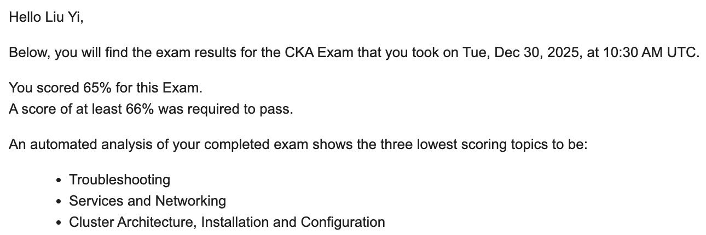
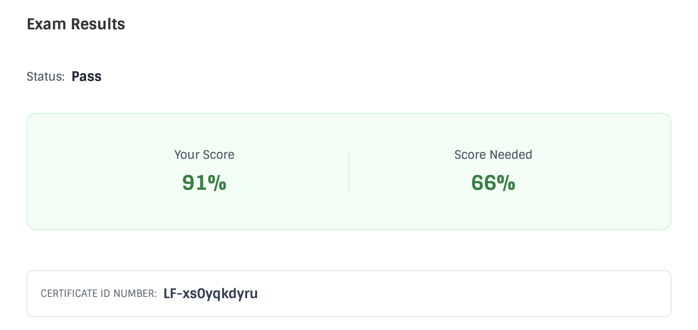
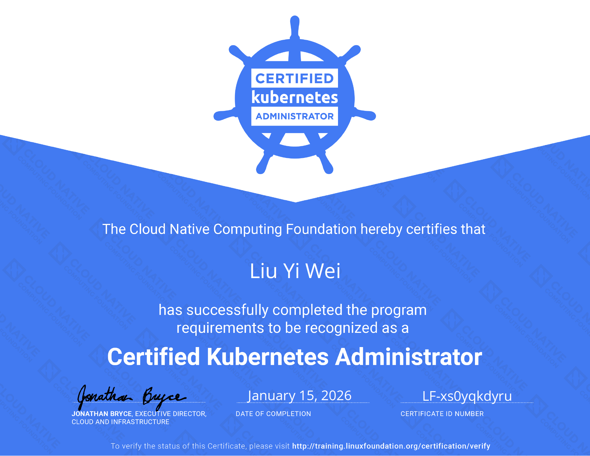
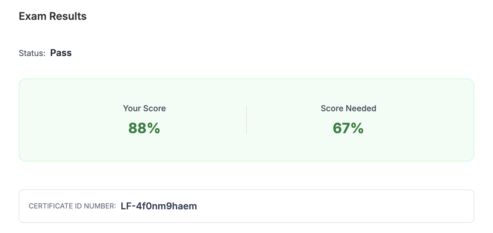
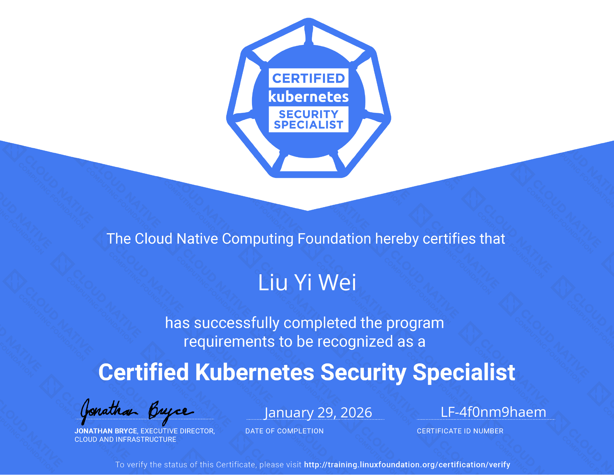
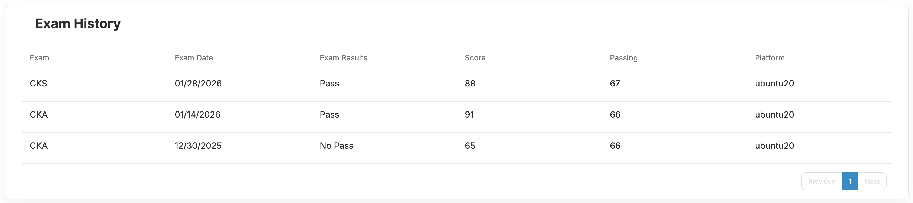

---
categories:
- Share
date: 2026-02-20
tags:
- Kubernetes
---

# Certified Kubernetes Administrator (CKA) 與 Certified Kubernetes Security Specialist (CKS) 認證考試心得分享

受惠於社群分享的資訊，在準備 [Certified Kubernetes Administrator](https://training.linuxfoundation.org/certification/certified-kubernetes-administrator-cka/) (CKA) 與 [Certified Kubernetes Security Specialist](https://training.linuxfoundation.org/certification/certified-kubernetes-security-specialist/) (CKS) 上順利了許多，簡單紀錄準備的過程與資源，提供給有興趣的朋友參考。

## 個人背景

背景對於準備的時間、方式會有很大的影響，簡單說明一下我的背景：

1. 第一次接觸 Kubernetes 應該是在 2019 年左右，至今約 6 年前，後續大約斷斷續續負責 4 年 Kubernetes 相關的工作，主要是負責開發相關的問題排除、使用評估、使用 Helm Chart 等，不負責維運 Kubernetes。
2. 6 年 DevOps 經驗，熟悉 CI/CD、三層式架構、Container，基礎的 Kubernetes、網路概念、Linux 知識、DevSecOps。

## 考前準備

無論是要考 CKA 或是 CKS，第一件要做的事情是確認最近的 Linux Foundation 特價日期！因為 Linux Foundation 的認證費用真的非常非常貴，CKA 跟 CKS 在 2025 年 2 月後調漲後至 $445 USD，兩個都考的話就要 $890 USD！但 Linux Foundation 經常會有特價活動，可以查看下面兩個長期紀錄特價資訊的頁面：

1. GitHub Repo [Linux Foundation Coupons](https://github.com/techiescamp/linux-foundation-coupon)
2. DevOpsCube [Linux Foundation Coupon](https://devopscube.com/linux-foundation-coupon/)

特價活動都是有固定檔期，折扣最多的一般是每年 11 月底感恩節後的 [Cyber Monday](https://zh.wikipedia.org/zh-tw/%E7%B6%B2%E8%B7%AF%E6%98%9F%E6%9C%9F%E4%B8%80) 檔期，可以折到 55% 以上。我這次是在 2025 年的 Cyber Monday 買了 CKA 跟 CKS 的 Bundle，價格是 $330 USD 共折了 66%。購買後要在一年內選擇時間參加考試，可以當作是某種程度的 Deadline Driven Learning。

學習資源主要使用 [Mumshad Mannambeth](https://www.udemy.com/user/mumshad-mannambeth/) 的 Udemy 課程和他創辦的 [KodeKloud](https://kodekloud.com/) 平台，以及許多大大分享的準備與考試心得，文章連結統一列於最後的參考資源中。

有購買 Mumshad 的課程的話他們也有提供考試優惠碼，如果急著取得認證也可以先使用不用等特價檔期，但折扣力道就會差很多。

## Certified Kubernetes Administrator (CKA)

### 學習資源

**學習資源**

Mumshad Mannambeth 的 [Certified Kubernetes Administrator (CKA) with Practice Tests](https://www.udemy.com/course/certified-kubernetes-administrator-with-practice-tests/) 與附贈的 KodeKloud Labs - $330 NTD

**模擬試題**

| 試題 | 回數 | 說明 |
|------|------|------|
| Udemy 附贈 KodeKloud Labs | 3 回 | 課程內附 |
| [Ultimate CKA Mock Exam Series](https://learn.kodekloud.com/user/courses/ultimate-certified-kubernetes-administrator-cka-mock-exam-series) | 5 回 | KodeKloud Standard Plan 訂閱內容 |
| 官方 killer.sh | 2 回 | 報名後附贈 |

### 準備過程

Mumshad 的 CKA Udemy 課程除了 Kubernetes 的基本概念外，也有單獨章節講解額外的 Linux 相關知識作為補充，內容都有持續在更新。課程中會附贈 KodeKloud 的 Lab，可以實際操作 Kubernetes 來加深印象，不用自己準備 Kubernetes 環境。我在看的時候因為對大部分的內容都有概念，所以一般都是開 1.5 倍速來看。

看完全部課程後就開始做附贈的 KodeKloud Labs 與 3 回模擬試題，做完一輪後分數大概在 70 ~ 80 之間，想說穩了就先報了考試，並在當天考試前才寫了一輪報名完成後附贈的 2 回 killer.sh 模擬試題，分數大約是一個 5x 一個 9x，想說再不濟應該都可以低空飛過，畢竟只要 66 分就算通過。

但做人還是不該心存僥倖，在時間跟操作環境的壓力下 16 題有 3 題跳過沒有寫。24 小時後收到考試結果通知，分數是 65 分，只差 1 分！不過還好可以免費重考一次，重考時間是第一次考試起算 12 個月內。

/// caption
未通過通知信件內容，會說明哪些項目需要加強
///

沒通過的原因其實就是不熟悉操作跟文件，所以調整了策略，以熟練考試方式為目標，訂閱了一個月的 KodeKloud Standard Plan，其中有包含 5 回 CKA 模擬試題，加上 Udemy 附贈的 3 回共 8 回。之後開始每天寫一回，重複練習到最後都可以穩定寫完一小時內寫完，兩週後重考就順利通過，分數為 91 分，一樣是完成考試約 24 小時後收到考試結果通知。

如果不小心落入重考的情況，要注意重考的時候是不會再提供一次官方附贈 killer.sh 模擬試題的，只能夠進入查看前一次的題目跟詳解。

/// caption
CKA 考試結果
///

/// caption
CKA 證書，另有 [Credly Badge](https://www.credly.com/badges/016805f7-71b9-4cfa-9549-2dab8ea745d9)
///

## Certified Kubernetes Security Specialist (CKS)

### 學習資源

**學習資源**

[KodeKloud Standard Plan](https://learn.kodekloud.com/user/pricing) 的 [Certified Kubernetes Security Specialist (CKS)](https://learn.kodekloud.com/user/courses/certified-kubernetes-security-specialist-cks) 課程 - $31.5 USD/month（使用[折扣碼](https://devopscube.com/kodekloud-coupons/)折 10% 後的價格）

**模擬試題**

| 試題 | 回數 | 說明 |
|------|------|------|
| [Killercoda CKS 練習題](https://killercoda.com/killer-shell-cks) | 38 個 Lab | 免費資源 |
| KodeKloud CKS 課程模擬試題 | 3 回 | KodeKloud Standard Plan 訂閱內容 |
| [KodeKloud Ultimate CKS Mock Exam Series](https://learn.kodekloud.com/user/courses/ultimate-certified-kubernetes-security-specialist-cks-mock-exam-series) | 3 回 | KodeKloud Standard Plan 訂閱內容 |
| 官方 killer.sh | 2 回 | 報名後附贈 |

### 準備過程

CKS 的準備方式與 CKA 類似，也是先完成課程跟 Lab，花約了 10 天的時間，因為大部分內容也是已經有概念的，所以一樣開 1.5 倍速來看。課程看完後先做完一輪 [Killercoda](https://killercoda.com/) 的 [CKS 練習](https://killercoda.com/killer-shell-cks)，熟悉題型跟內容。接著比照 CKA 的策略，不停反覆作做模擬試題，然後在考前週末做 killer.sh 模擬試題，重複練習到最後都可以穩定寫完一小時內寫完。

有了兩次 CKA 的考試經驗，加上充足的練習，考試的心情就有比較穩定，不過也還是兩個小時寫好寫滿，沒有太多多餘的時間進行檢查。最後是 88 分通過，考試結果通知也是在完成考試約 24 小時後收到。

/// caption
CKS 考試結果
///

/// caption
CKS 證書，另有 [Credly Badge](https://www.credly.com/badges/de3b00d0-30f0-4180-b7d4-b9c0b00bdd63)
///

## 考試技巧與注意事項

相對於前陣子考的 [AWS SAA 跟 SAP](../2025/2025-12-14-aws-certification.md)，CKA 跟 CKS 準備起來有趣很多，因為都是實際動手操作，考試時也允許查詢[官方文件](https://kubernetes.io/docs/home/)，少掉很多背誦的負擔，解題的過程有很好的回饋感。

不過也因為是實際操作，除了知識點的掌握之外，如何流暢與穩定地在兩小時內完成 16 題是影響考試結果的重要因素，以下是一些考試注意事項與技巧：

### Vim

一般應該都是使用 Vim 來編輯各種 YAML，以下是一些在考試時常用的 Vim 操作指令，在練習過程中也要盡量熟悉這些指令，才能夠在考試時可以流暢地操作：

| 功能 | 指令 | 備註 |
|------|------|------|
| **移動** |||
| 往後移動一個字 | `e` | |
| 往前移動一個字 | `b` | |
| 文件開頭 | `g+g` | |
| 文件結尾 | `G` | |
| 該行結尾 | `$` | 鍵盤 Home 更好操作 |
| 該行開頭 | `^` | 鍵盤 End 更好操作 |
| Page up (backward) | `Ctrl+b` | 鍵盤 Page Up 更好操作 |
| Page down (forward) | `Ctrl+f` | 鍵盤 Page Down 更好操作 |
| **刪除** |||
| 刪除到該行結尾 | `D` | |
| 刪除該行 | `dd` | |
| 往後刪除字 | `de` | |
| 往前刪除字 | `db` | |
| **搜尋** |||
| 向下搜尋 | `/` | |
| 向上搜尋 | `?` | |
| 下一個結果 | `n` | |
| 上一個結果 | `N` | |
| **縮排** |||
| 選取行 | `Shift + v` | 上下鍵選取多排，esc 取消選取 |
| 反向縮排 | 選取後 `>` | 可重複按 `.` 持續反向縮排 |
| 縮排 | 選取後 `<` | 可重複按 `.` 持續縮排 |
| **其他** |||
| 重複上一個動作 | `.` | 如執行刪除、縮排等 |

### 常用 Linux 指令

各種 Linux 指令也會在考試中用到，特別是 CKS 會需要更多的 Linux 指令來協助排除問題，如果不熟悉或不知道一些指令的用法，可能會無法完成題目。以下是我在考試中常用的指令：

**kubectl 相關**

- `k`：alias 一開始就會設定好，練習時可以都用 `k`
- `k create --dry-run=client -o yaml > file.yaml`：快速生成 YAML template
- `k api-resources`：列出所有支援的 Resource
- `k explain --recursive`：遞迴列出 Resource 欄位說明
- `k get -o custom-columns=...`：自訂輸出格式，可以用 `-h` 查看語法
- `k get -o wide`：顯示更多欄位資訊，例如 pod 所在 Node
- `k get --show-labels`：顯示 labels

**系統管理**

- `systemctl status/restart [service]`：管理 Daemon Service（kubelet、falco 等）
- `systemctl daemon-reload`：重新載入 Service 配置
- `journalctl -u [service] -g [log string]`：查看服務 Log 並搜尋特定字串

**文字處理與監控**

- `grep`：搜尋與過濾，常用 `| grep` 過濾輸出或 `-A [n]`、`-B [m]` 列出往前 n 行與往後 m 行
- `watch [command]`：持續監控指令輸出，例如 `watch kubectl get po -A` 或是 `watch crictl ps -a`
- `tail -n [number]`：顯示最後 n 行輸出
- `-h, --help`：幾乎所有指令都支援，查看參數說明

### 考試環境

考試需要準備一間不會被打擾的房間，我選擇搬一張桌子到臥室考，使用 14" MacBook 考試，自己是覺得在自己熟悉跟可控的環境下會比較穩定。

考試時會需要用專用的 PSI 瀏覽器，如 [Important Instructions: CKA and CKAD
](https://docs.linuxfoundation.org/tc-docs/certification/tips-cka-and-ckad#adjusting-font-and-windows-in-the-examui) 文件中所示。左側為題目上方會有建議參考的文件連結，右側為 Linux Desktop 供使用 Terminal 跟 Firefox，大致與 Skill.sh 模擬中操作相同。Linux Desktop 我有縮小一級顯示，在 14" MacBook 就能夠完整看到的 Linux Desktop 畫面。

要注意複製貼上的指令跟平常不同：

1. Terminal：複製貼上是 ++ctrl+shift+c++ 跟 ++ctrl+shift+v++
2. Linux Desktop：複製貼上是 ++ctrl+c++ 跟 ++ctrl+v++
3. 左側題目：Highlight 的內容可以點選直接複製

詳細可以參考 [Exam Technical Instructions](https://docs.linuxfoundation.org/tc-docs/certification/tips-cka-and-ckad#exam-technical-instructions) 的說明。

### Tips

- 題目要認真仔細看完，有些可能是二選一，確定哪個符合題目要求條件，有些可能要求你最後要額外做什麼。
- 如果是考 CKS，建議看完 celin 大大推薦的這篇 [Reddit Helping with understanding some Questions](https://www.reddit.com/r/kubernetes/comments/1h766hb/helping_with_understanding_some_questions/) 討論串，能夠對一些刁鑽的題目有個概念。
- 考試題目中提供的文件快速連結非常有用，建議在考試時就善加利用，可以省掉自己搜尋的時間。
    - 練習時要熟悉要下哪些關鍵字查詢，以及目標內容大概落在文件哪個區塊、可以用哪些關鍵字 ++ctrl+f++ 快速定位，推薦 Michael 大大整理的這份 [CKA 常用的官方文件](https://github.com/michaelchen1225/CKA-note/blob/main/%E9%99%84%E9%8C%84/CKA%20%E5%B8%B8%E7%94%A8%E7%9A%84%E5%AE%98%E6%96%B9%E6%96%87%E4%BB%B6.md)。
    - CKA 基本上都可以利用提供的文件解決問題，CKS 的話則是還會需要自己搜尋一些額外的文件。

## 總結

CKA 的 Udemy 課程其實是 2022 年年底就跟 CKAD 一起買的，但因為許多原因，當時 CKA 看了一半就扔著了，雖然可能大部分只是因為懶。一直到了去年才開始有比較完整的規劃，才決定要把 CKA 跟 CKS 都考到，選擇直接略過 CKAD 則是考量到時間跟費用，想說都要考了，那就直攻最難的 CKS，CKAD 等之後有緣再考慮看看。

從把剩下一半的 CKA 課程看完開始到 CKS 考取總共花了約 5 個禮拜，都在下班時間跟假日準備，時序上準備 CKA 重考跟 CKS 是有重疊的，也是這樣才能夠剛好只訂閱一個月的 KodeKloud。證照與教材費用總共花費了約 $11,500 NTD （美金台幣匯率以 1:31 計算）。

/// caption
考試時間與分數
///

希望這篇文章能幫助到有興趣準備 Kubernetes 認證的朋友們，通過的秘訣與學習技術一樣「惟手熟爾」。最後，能保握的折扣一定要把握呀！

## 參考資源

1. 鐵人賽系列文：[入門 Kubernetes 到考取 CKA 證照](https://ithelp.ithome.com.tw/users/20168692/ironman/7376)
2. [CKA 攻略：我是如何滿分 & 一次通過的？](https://ithelp.ithome.com.tw/articles/10354313)
3. [準備 CKS 的實戰心得分享](https://ithelp.ithome.com.tw/articles/10398957)
4. [好好當個老船長 KCNA/CKA/CKAD/CKS 認證考試心得](https://medium.com/@KimiHuang/%E5%A5%BD%E5%A5%BD%E7%95%B6%E5%80%8B%E8%80%81%E8%88%B9%E9%95%B7-kcna-cka-ckad-cks-%E8%AA%8D%E8%AD%89%E8%80%83%E8%A9%A6%E5%BF%83%E5%BE%97-846c83140920)
5. [Certified Kubernetes Security Specialist (CKS) 考照筆記](https://weii.dev/cks/)
6. [從「有」基礎到三星期內獲取 Kubestronaut 心得](https://blog.yangjerry.tw/how-to-get-kubestronaut-in-three-weeks/)
7. [2024 CKA 考試資訊完整整理：98 分備考秘訣與最新規範](https://vocus.cc/article/6755a4ebfd89780001858c20)
8. [Certified Kubernetes Security Specialist (CKS) 考照筆記](https://weii.dev/cks/)
9. [\[心得\] CKA、CKAD 證照準備心得](https://www.ptt.cc/bbs/Soft_Job/M.1740370039.A.FD8.html)
